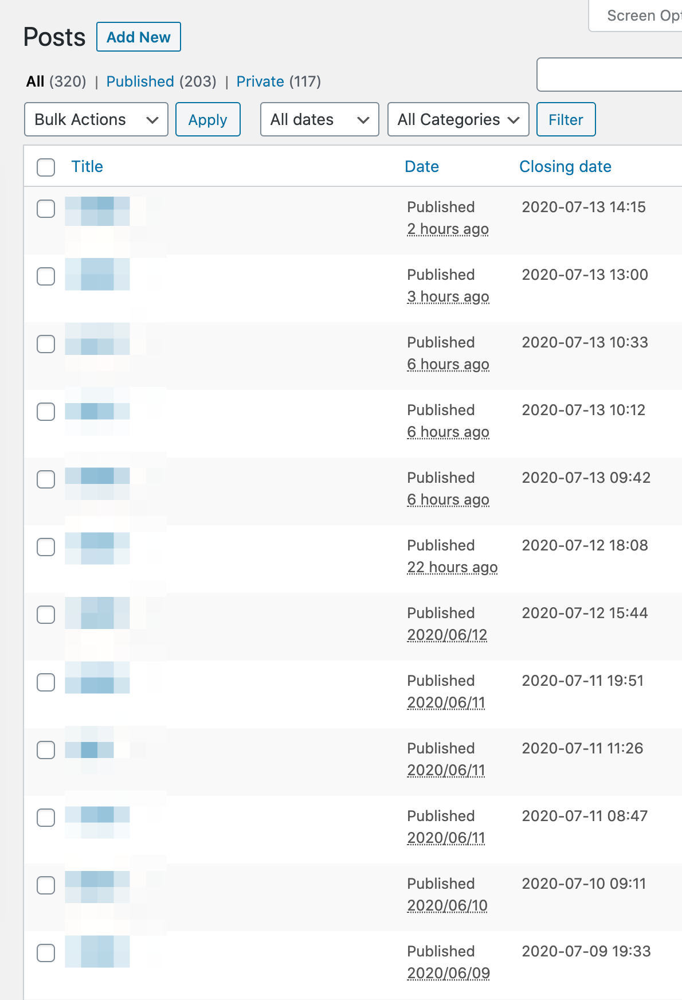
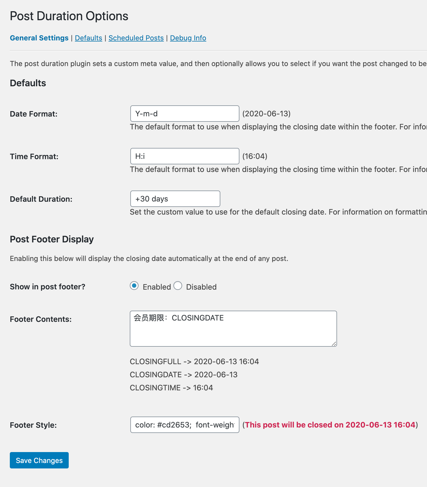
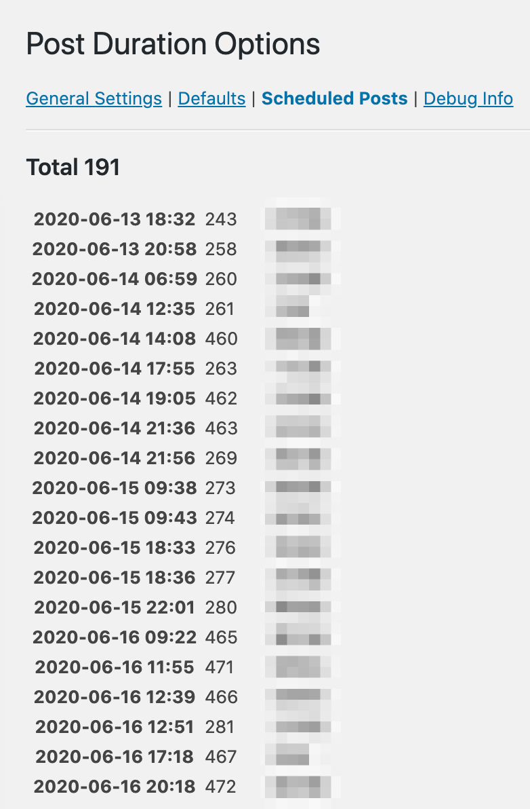

# Post Duration

Allows you to add a closing date to a post which you can change to either draft or private.
This plugin is based on "Post Expirator" by Aaron Axelsen, thanks to him. It can be seen as a lite version of it.

## Description

The Post Duration plugin allows the user to set closing dates for both posts and pages.  There are a number of different ways that the posts can expire:

* Draft
* Private

For each closing event, a custom cron job will be schedule which will help reduce server overhead for busy sites.

The closing date can be displayed within the actual post. The format attribute will override the plugin 
default display format.  See the [PHP Date Function](http://us2.php.net/manual/en/function.date.php) for valid date/time format options. 

NOTE: This plugin REQUIRES that WP-CRON is setup and functional on your webhost.  Some hosts do not support this, so please check and confirm if you run into issues using the plugin.

Plugin homepage [WordPress Post Duration](https://fofen.top).

## Installation

This section describes how to install the plugin and get it working.

1. Unzip the plugin contents to the `/wp-content/plugins/post-duration/` directory
2. Activate the plugin through the 'Plugins' menu in WordPress

## Screenshots

1. Adding closing date to a post

2. Viewing the exipiration dates on the post overview screen

3. Settings screen

4. Scheduled post (cron job list)

## Changelog

### 20.0609
First edition.
